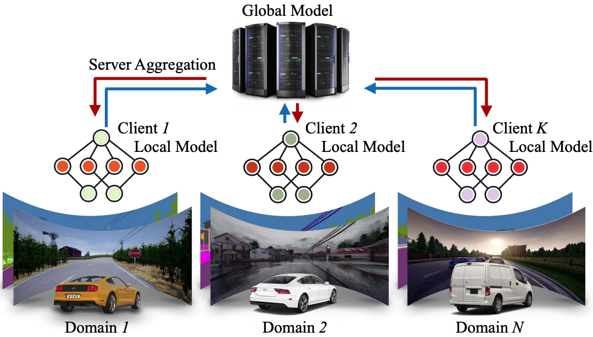
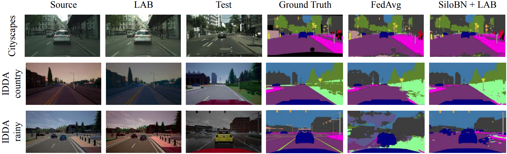

<meta http-equiv="Content-Type" content="text/html; charset=utf-8" />
<link href="style.css" rel="stylesheet" />

<header>
  
  <span>A FEDERATED LEARNING BENCHMARK FOR SEMANTIC SEGMENTATION IN AUTONOMOUS DRIVING</span>
</header>

<hr />

[How to cite us](#cite-us) / [Summary](#summary) / [Code](#code) / [Dataset](#dataset)
/ [Results](#results)

<div id="top"></div>

**Official website** of:
- [E. Fanì](https://scholar.google.com/citations?user=rwto7AgAAAAJ&hl=it), [M. Ciccone](https://scholar.google.com/citations?user=hOQjblcAAAAJ&hl=it), [B. Caputo](https://scholar.google.com/citations?user=mHbdIAwAAAAJ&hl=it). [**FedDrive v2: an Analysis of the Impact of Label Skewness in 
  Federated Semantic Segmentation for Autonomous Driving**](https://arxiv.org/abs/2309.13336). _5th Italian Conference on Robotics and Intelligent
  Machines (I-RIM)_, 2023.
- L. Fantauzzo<sup>\*</sup>, [E. Fanì](https://scholar.google.com/citations?user=rwto7AgAAAAJ&hl=it)<sup>\*</sup>, [D. Caldarola](https://scholar.google.com/citations?user=rX-VwlcAAAAJ&hl=it), [A. Tavera](https://scholar.google.com/citations?user=oQfTuXMAAAAJ&hl=it),
  [F. Cermelli](https://scholar.google.com/citations?user=-fEOFbMAAAAJ&hl=it)<sup>1</sup>, [M. Ciccone](https://scholar.google.com/citations?user=hOQjblcAAAAJ&hl=it), [B. Caputo](https://scholar.google.com/citations?user=mHbdIAwAAAAJ&hl=it). [**FedDrive: Generalizing Federated Learning to 
  Semantic Segmentation in Autonomous Driving**](https://arxiv.org/abs/2202.13670), _IEEE/RSJ International
  Conference on Intelligent Robots and Systems_, 2022.


**Corresponding author:** eros.fani@polito.it.

All the authors are supported by Politecnico di Torino, Turin, Italy. 

<sup>\*</sup>Equal contribution.
<sup>1</sup>Fabio Cermelli is with Italian Institute of Technology, Genoa, Italy.



## Citation
<div class="go_top" id="cite-us">
 <a href="#top">↑</a>
</div>

If you find our work relevant to your research or use our code, please cite our papers:

```
@article{feddrivev2,
  title={FedDrive v2: an Analysis of the Impact of Label Skewness in Federated Semantic Segmentation for Autonomous Driving},
  author={Fanì, Eros and Ciccone, Marco and Caputo, Barbara},
  journal={5th Italian Conference on Robotics and Intelligent Machines (I-RIM)},
  year={2023}
}

@inproceedings{feddrive2022,
  title={FedDrive: Generalizing Federated Learning to Semantic Segmentation in Autonomous Driving},
  author={Fantauzzo, Lidia and Fanì, Eros and Caldarola, Debora and Tavera, Antonio and Cermelli, Fabio and Ciccone, Marco and Caputo, Barbara},
  booktitle={Proceedings of the 2022 IEEE/RSJ International Conference on Intelligent Robots and Systems},
  year={2022}
}
```

## Summary
<div class="go_top" id="summary">
 <a href="#top">↑</a>
</div>

**FedDrive** is a new benchmark for the **Semantic Segmentation** task in a **Federated Learning** scenario for
**autonomous driving**.

It consists of <u>12 distinct scenarios</u>, incorporating the real-world challenges of <u>statistical heterogeneity</u>
and <u>domain generalization</u>. FedDrive incorporates algorithms and style transfer methods from Federated Learning,
Domain  Generalization, and Domain Adaptation literature. Its main goal is to enhance model generalization and
robustness against statistical heterogeneity.

We show the importance of using the correct clients’ statistics when dealing with different domains and label skewness
and how  style transfer techniques can improve the performance on unseen domains, proving FedDrive to be a solid
baseline for future research in federated semantic segmentation.

<table class="table_max">
  <caption>Summary of the FedDrive scenarios.</caption>
  <thead>
    <tr>
      <th>Dataset</th>
      <th>Setting</th>
      <th>Distribution</th>
      <th># Clients</th>
      <th># img/cl</th>
      <th>Test clients</th>
    </tr>
  </thead>
  <tbody>
    <tr>
      <td> Cityscapes </td>
      <td> - </td>
      <td> <span class="uniform">Uniform</span>, <span class="heterogeneous">Heterogeneous</span>, 
        <span class="imbalance">Class Imbalance</span> </td>
      <td> 146 </td>
      <td> 10-45 </td>
      <td> unseen cities </td>
    </tr>
    <tr>
      <td rowspan="3"> IDDA </td>
      <td> <span class="country">Country</span> </td>
      <td> <span class="uniform">Uniform</span>, <span class="heterogeneous">Heterogeneous</span>, 
        <span class="imbalance">Class Imbalance</span> </td>
      <td> 90 </td>
      <td> 48 </td>
      <td> seen + unseen (country) domains </td>
    </tr>
    <tr>
      <td> <span class="rainy">Rainy</span> </td>
      <td> <span class="uniform">Uniform</span>, <span class="heterogeneous">Heterogeneous</span>, 
        <span class="imbalance">Class Imbalance</span> </td>
      <td> 69 </td>
      <td> 48 </td>
      <td> seen + unseen (rainy) domains </td>
    </tr>
    <tr>
      <td> <span class="bus">Bus</span> </td>
      <td> <span class="uniform">Uniform</span>, <span class="heterogeneous">Heterogeneous</span>, 
        <span class="imbalance">Class Imbalance</span> </td>
      <td> 83 </td>
      <td> 48 </td>
      <td> seen + unseen (bus) domains </td>
    </tr>
  </tbody>
</table>

## Source code
<div class="go_top" id="code">
 <a href="#top">↑</a>
</div>

Python code based on PyTorch is open-source and available on [GitHub](https://github.com/Erosinho13/FedDrive).

## Download of the datasets
<div class="go_top" id="dataset">
 <a href="#top">↑</a>
</div>

Download the Cityscapes dataset from [here](https://www.cityscapes-dataset.com/downloads/).
You may need a new account if you do not have one yet. Download the ```gtFine_trainvaltest.zip``` and ```leftImg8bit_trainvaltest.zip```archives.

Ask for the ```IDDA V3``` version of IDDA, available [here](https://idda-dataset.github.io/home/download/).

You can find all the 12 scenarios in the ```data``` directory of our 
[official repository](https://github.com/Erosinho13/FedDrive).

## Results
<div class="go_top" id="results">
 <a href="#top">↑</a>
</div>

### Cityscapes

<table>
  <thead>
    <tr>
      <th>Distribution</th>
      <th>Method</th>
      <th>CFSI</th>
      <th>LAB</th>
      <th>mIoU ± std (%)</th>
    </tr>
  </thead>
  <tbody>
    <tr>
      <td><span class="uniform">Uniform</span></td>
      <td>FedAvg</td>
      <td>✗</td>
      <td>✗</td>
      <td>45.62 ± 1.25</td>
    </tr>
    <tr>
      <td rowspan="6"><span class="heterogeneous">Heterogeneous</span></td>
      <td rowspan="3">FedAvg</td>
      <!--<td>✓</td>-->
      <td>✗</td>
      <td>✗</td>
      <td>43.33 ± 1.66</td>
    </tr>
    <tr>
      <td>✓</td>
      <td>✗</td>
      <td>40.55 ± 2.15</td>
    </tr>
    <tr>
      <td>✗</td>
      <td>✓</td>
      <td>42.69 ± 2.07</td>
    </tr>
    <tr>
      <td rowspan="3">SiloBN</td>
      <td>✗</td>
      <td>✗</td>
      <td>52.86 ± 1.29</td>
    </tr>
    <tr>
      <td>✓</td>
      <td>✗</td>
      <td>52.11 ± 1.83</td>
    </tr>
    <tr>
      <td>✗</td>
      <td>✓</td>
      <td>53.37 ± 1.65</td>
    </tr>
    <tr>
      <td rowspan="6"><span class="imbalance">Class Imbalance</span></td>
      <td rowspan="3">FedAvg</td>
      <!--<td>✓</td>-->
      <td>✗</td>
      <td>✗</td>
      <td>44.48 ± 1.70</td>
    </tr>
    <tr>
      <td>✓</td>
      <td>✗</td>
      <td>48.28 ± 1.83</td>
    </tr>
    <tr>
      <td>✗</td>
      <td>✓</td>
      <td>44.34 ± 1.73</td>
    </tr>
    <tr>
      <td rowspan="3">SiloBN</td>
      <td>✗</td>
      <td>✗</td>
      <td>51.78 ± 1.15</td>
    </tr>
    <tr>
      <td>✓</td>
      <td>✗</td>
      <td>50.82 ± 1.08</td>
    </tr>
    <tr>
      <td>✗</td>
      <td>✓</td>
      <td>51.48 ± 1.22</td>
    </tr>
  </tbody>
</table>

### IDDA

#### FedAvg experiments
Results are expressed as mIoU ± std (%).

<table>
  <thead>
    <tr>
      <th>Distribution</th>
      <th>Setting</th>
      <th>CFSI</th>
      <th>LAB</th>
      <th>Unseen</th>
      <th>Seen</th>
    </tr>
  </thead>
  <tbody>
    <tr>
      <td rowspan="3"><span class="uniform">Uniform</span></td>
      <td><span class="country">Country</span></td>
      <td>✗</td>
      <td>✗</td>
      <td>49.74 ± 0.79</td>
      <td>63.57 ± 0.60</td>
    </tr>
    <tr>
      <td><span class="rainy">Rainy</span></td>
      <td>✗</td>
      <td>✗</td>
      <td>27.61 ± 2.80</td>
      <td>62.72 ± 3.65</td>
    </tr>
    <tr>
      <td><span class="bus">Bus</span></td>
      <td>✗</td>
      <td>✗</td>
      <td>58.51 ± 1.32</td>
      <td>64.87 ± 0.65</td>
    </tr>
    <tr>
      <td rowspan="9"><span class="heterogeneous">Heterogeneous</span></td>
      <td rowspan="3"><span class="country">Country</span></td>
      <td>✗</td>
      <td>✗</td>
      <td>40.01 ± 1.26</td>
      <td>42.43 ± 1.78</td>
    </tr>
    <tr>
      <td>✓</td>
      <td>✗</td>
      <td>45.70 ± 1.73</td>
      <td>54.70 ± 1.12</td>
    </tr>
    <tr>
      <td>✗</td>
      <td>✓</td>
      <td>45.68 ± 1.04</td>
      <td>56.59 ± 0.90</td>
    </tr>
    <tr>
      <td rowspan="3"><span class="rainy">Rainy</span></td>
      <td>✗</td>
      <td>✗</td>
      <td>26.75 ± 2.32</td>
      <td>38.18 ± 1.40</td>
    </tr>
    <tr>
      <td>✓</td>
      <td>✗</td>
      <td>31.05 ± 2.68</td>
      <td>55.24 ± 1.65</td>
    </tr>
    <tr>
      <td>✗</td>
      <td>✓</td>
      <td>26.82 ± 1.78</td>
      <td>58.85 ± 0.89</td>
    </tr>
    <tr>
      <td rowspan="3"><span class="bus">Bus</span></td>
      <td>✗</td>
      <td>✗</td>
      <td>38.13 ± 1.96</td>
      <td>45.71 ± 1.65</td>
    </tr>
    <tr>
      <td>✓</td>
      <td>✗</td>
      <td>48.88 ± 1.46</td>
      <td>56.93 ± 1.39</td>
    </tr>
    <tr>
      <td>✗</td>
      <td>✓</td>
      <td>50.48 ± 1.09</td>
      <td>58.84 ± 0.97</td>
    </tr>
    <tr>
      <td rowspan="9"><span class="imbalance">Class Imbalance</span></td>
      <td rowspan="3"><span class="country">Country</span></td>
      <td>✗</td>
      <td>✗</td>
      <td>47.58 ± 0.69</td>
      <td>58.09 ± 0.78</td>
    </tr>
    <tr>
      <td>✓</td>
      <td>✗</td>
      <td>48.69 ± 0.82</td>
      <td>59.67 ± 0.88</td>
    </tr>
    <tr>
      <td>✗</td>
      <td>✓</td>
      <td>48.91 ± 0.78</td>
      <td>60.07 ± 1.18</td>
    </tr>
    <tr>
      <td rowspan="3"><span class="rainy">Rainy</span></td>
      <td>✗</td>
      <td>✗</td>
      <td>29.46 ± 1.90</td>
      <td>58.75 ± 1.45</td>
    </tr>
    <tr>
      <td>✓</td>
      <td>✗</td>
      <td>25.69 ± 2.77</td>
      <td>60.37 ± 0.60</td>
    </tr>
    <tr>
      <td>✗</td>
      <td>✓</td>
      <td>29.11 ± 1.68</td>
      <td>61.22 ± 0.98</td>
    </tr>
    <tr>
      <td rowspan="3"><span class="bus">Bus</span></td>
      <td>✗</td>
      <td>✗</td>
      <td>53.29 ± 2.05</td>
      <td>60.47 ± 1.75</td>
    </tr>
    <tr>
      <td>✓</td>
      <td>✗</td>
      <td>52.91 ± 1.33</td>
      <td>61.24 ± 1.24</td>
    </tr>
    <tr>
      <td>✗</td>
      <td>✓</td>
      <td>54.01 ± 1.15</td>
      <td>62.10 ± 0.55</td>
    </tr>
  </tbody>
</table>

#### SiloBN experiments

<table>
  <caption>Distribution: <span class="heterogeneous">heterogeneous</span>.</caption>
  <thead>
    <tr>
      <th rowspan="2">Setting</th>
      <th rowspan="2">CFSI</th>
      <th rowspan="2">LAB</th>
      <th rowspan="2">Unseen</th>
      <th colspan="2">Seen</th>
    </tr>
    <tr>
    <th>Standard</th>
    <th>By Domain</th>
    </tr>
  </thead>
  <tbody>
    <tr>
      <td rowspan="3"><span class="country">Country</span></td>
      <td>✗</td>
      <td>✗</td>
      <td>45.32 ± 0.90</td>
      <td>54.46 ± 0.72</td>
      <td>58.82 ± 2.93</td>
    </tr>
    <tr>
      <td>✓</td>
      <td>✗</td>
      <td>49.17 ± 1.01</td>
      <td>63.43 ± 0.58</td>
      <td>61.22 ± 3.88</td>
    </tr>
    <tr>
      <td>✗</td>
      <td>✓</td>
      <td>50.43 ± 0.63</td>
      <td>64.59 ± 0.45</td>
      <td>64.32 ± 0.76</td>
    </tr>
    <tr>
      <td rowspan="3"><span class="rainy">Rainy</span></td>
      <td>✗</td>
      <td>✗</td>
      <td>50.03 ± 0.79</td>
      <td>54.36 ± 0.83</td>
      <td>62.48 ± 1.42</td>
    </tr>
    <tr>
      <td>✓</td>
      <td>✗</td>
      <td>50.54 ± 0.88</td>
      <td>64.85 ± 0.72</td>
      <td>63.04 ± 0.31</td>
    </tr>
    <tr>
      <td>✗</td>
      <td>✓</td>
      <td>53.99 ± 0.79</td>
      <td>65.90 ± 0.55</td>
      <td>65.85 ± 0.91</td>
    </tr>
    <tr>
      <td rowspan="3"><span class="bus">Bus</span></td>
      <td>✗</td>
      <td>✗</td>
      <td>47.37 ± 0.80</td>
      <td>57.84 ± 0.89</td>
      <td>61.56 ± 1.39</td>
    </tr>
    <tr>
      <td>✓</td>
      <td>✗</td>
      <td>55.84 ± 0.99</td>
      <td>65.78 ± 0.81</td>
      <td>64.03 ± 2.68</td>
    </tr>
    <tr>
      <td>✗</td>
      <td>✓</td>
      <td>56.23 ± 0.64</td>
      <td>66.98 ± 0.34</td>
      <td>66.23 ± 0.83</td>
    </tr>
  </tbody>
</table>

<div style="display: block; margin-top: 1.5rem"></div>

<table>
  <caption>Distribution: <span class="imbalance">class imbalance</span>.</caption>
  <thead>
    <tr>
      <th>Setting</th>
      <th>CFSI</th>
      <th>LAB</th>
      <th>Unseen</th>
      <th>Seen</th>
    </tr>
  </thead>
  <tbody>
    <tr>
      <td rowspan="3"><span class="country">Country</span></td>
      <td>✗</td>
      <td>✗</td>
      <td>51.19 ± 0.55</td>
      <td>66.46 ± 0.35</td>
    </tr>
    <tr>
      <td>✓</td>
      <td>✗</td>
      <td>51.73 ± 0.69</td>
      <td>67.22 ± 0.41</td>
    </tr>
    <tr>
      <td>✗</td>
      <td>✓</td>
      <td>53.10 ± 0.55</td>
      <td>67.33 ± 0.36</td>
    </tr>
    <tr>
      <td rowspan="3"><span class="rainy">Rainy</span></td>
      <td>✗</td>
      <td>✗</td>
      <td>54.68 ± 0.56</td>
      <td>66.41 ± 0.53</td>
    </tr>
    <tr>
      <td>✓</td>
      <td>✗</td>
      <td>54.35 ± 1.03</td>
      <td>67.07 ± 0.39</td>
    </tr>
    <tr>
      <td>✗</td>
      <td>✓</td>
      <td>52.91 ± 0.84</td>
      <td>67.63 ± 0.32</td>
    </tr>
    <tr>
      <td rowspan="3"><span class="bus">Bus</span></td>
      <td>✗</td>
      <td>✗</td>
      <td>57.63 ± 0.59</td>
      <td>67.54 ± 0.41</td>
    </tr>
    <tr>
      <td>✓</td>
      <td>✗</td>
      <td>57.68 ± 0.66</td>
      <td>67.89 ± 0.59</td>
    </tr>
    <tr>
      <td>✗</td>
      <td>✓</td>
      <td>58.02 ± 0.55</td>
      <td>67.80 ± 0.43</td>
    </tr>
  </tbody>
</table>

#### Qualitative results



### Server optimizers comparison on IDDA

<table class="table_max">
  <caption>FedAvg results.</caption>
  <thead>
    <tr>
      <th rowspan="2">Distribution</th>
      <th rowspan="2">Setting</th>
      <th colspan="2">SGD</th>
      <th colspan="2">FedAvgM</th>
      <th colspan="2">Adam</th>
      <th colspan="2">AdaGrad</th>
    </tr>
    <tr>
      <th>Unseen</th>
      <th>Seen</th>
      <th>Unseen</th>
      <th>Seen</th>
      <th>Unseen</th>
      <th>Seen</th>
      <th>Unseen</th>
      <th>Seen</th>
    </tr>
  </thead>
  <tbody>
    <tr>
      <td rowspan="3"><span class="uniform">Uniform</span></td>
      <td><span class="country">Country</span></td>
      <td>49.74 ± 0.79</td>
      <td>63.57 ± 0.60</td>
      <td>55.47 ± 1.07</td>
      <td>71.27 ± 0.85</td>
      <td>50.21 ± 0.40</td>
      <td>63.31 ± 0.37</td>
      <td>46.09 ± 0.83</td>
      <td>59.44 ± 0.94</td>
    </tr>
    <tr>
      <td><span class="rainy">Rainy</span></td>
      <td>27.61 ± 2.80</td>
      <td>62.72 ± 3.65</td>
      <td>29.83 ± 2.03</td>
      <td>70.99 ± 0.71</td>
      <td>31.72 ± 1.74</td>
      <td>65.39 ± 0.52</td>
      <td>27.80 ± 1.29</td>
      <td>59.45 ± 1.30</td>
    </tr>
    <tr>
      <td><span class="bus">Bus</span></td>
      <td>58.51 ± 1.32</td>
      <td>64.87 ± 0.65</td>
      <td>62.32 ± 1.25</td>
      <td>71.76 ± 0.37</td>
      <td>58.57 ± 0.43</td>
      <td>64.77 ± 0.38</td>
      <td>53.96 ± 1.21</td>
      <td>61.19 ± 0.96</td>
    </tr>
    <tr>
      <td rowspan="3"><span class="heterogeneous">Heterogeneous</span></td>
      <td><span class="country">Country</span></td>
      <td>40.01 ± 1.26</td>
      <td>42.43 ± 1.78</td>
      <td>42.42 ± 2.15</td>
      <td>44.38 ± 1.98</td>
      <td>38.15 ± 1.89</td>
      <td>39.93 ± 2.44</td>
      <td>38.03 ± 1.65</td>
      <td>40.89 ± 2.05</td>
    </tr>
    <tr>
      <td><span class="rainy">Rainy</span></td>
      <td>26.75 ± 2.32</td>
      <td>38.18 ± 1.40</td>
      <td>31.91 ± 3.77</td>
      <td>41.21 ± 1.98</td>
      <td>28.47 ± 2.56</td>
      <td>37.97 ± 2.04</td>
      <td>27.08 ± 2.85</td>
      <td>39.02 ± 1.71</td>
    </tr>
    <tr>
      <td><span class="bus">Bus</span></td>
      <td>38.13 ± 1.96</td>
      <td>45.71 ± 1.65</td>
      <td>40.39 ± 1.56</td>
      <td>48.92 ± 1.54</td>
      <td>38.88 ± 1.35</td>
      <td>45.15 ± 1.11</td>
      <td>37.21 ± 1.60</td>
      <td>44.51 ± 1.34</td>
    </tr>
    <tr>
      <td rowspan="3"><span class="imbalance">Class Imbalance</span></td>
      <td><span class="country">Country</span></td>
      <td>47.58 ± 0.69</td>
      <td>58.09 ± 0.78</td>
      <td>50.22 ± 1.17</td>
      <td>63.01 ± 1.20</td>
      <td>47.38 ± 0.58</td>
      <td>58.98 ± 0.66</td>
      <td>44.64 ± 1.29</td>
      <td>55.50 ± 0.97</td>
    </tr>
    <tr>
      <td><span class="rainy">Rainy</span></td>
      <td>29.46 ± 1.90</td>
      <td>58.75 ± 1.45</td>
      <td>32.30 ± 1.93</td>
      <td>63.96 ± 1.11</td>
      <td>35.78 ± 1.93</td>
      <td>57.50 ± 1.17</td>
      <td>29.31 ± 1.22</td>
      <td>55.87 ± 1.87</td>
    </tr>
    <tr>
      <td><span class="bus">Bus</span></td>
      <td>53.29 ± 2.05</td>
      <td>60.47 ± 1.75</td>
      <td>54.71 ± 1.65</td>
      <td>64.45 ± 1.00</td>
      <td>53.13 ± 0.71</td>
      <td>60.97 ± 0.69</td>
      <td>48.95 ± 1.48</td>
      <td>57.57 ± 1.37</td>
    </tr>
  </tbody>
</table>

<div style="display: block; margin-top: 1.5rem"></div>

<table>
  <caption>Server optimizers comparison using SiloBN on the <span class="heterogeneous">Heterogeneous</span>
    distribution. </caption>
  <thead>
    <tr>
      <th rowspan="2">Setting</th>
      <th rowspan="2">Optimizer</th>
      <th rowspan="2">Unseen</th>
      <th colspan="2">Seen</th>
    </tr>
    <tr>
      <th>Standard</th>
      <th>By Domain</th>
    </tr>
  </thead>
  <tbody>
    <tr>
      <td rowspan="4"><span class="country">Country</span></td>
      <td>SGD</td>
      <td>45.32 ± 0.90</td>
      <td>54.46 ± 0.72</td>
      <td>58.82 ± 2.93</td>
    </tr>
    <tr>
      <td>FedAvgM</td>
      <td>46.20 ± 1.20</td>
      <td>54.56 ± 1.29</td>
      <td>61.99 ± 1.51</td>
    </tr>
    <tr>
      <td>Adam</td>
      <td>42.31 ± 0.84</td>
      <td>52.46 ± 0.83</td>
      <td>58.36 ± 1.26</td>
    </tr>
    <tr>
      <td>AdaGrad</td>
      <td>41.69 ± 1.31</td>
      <td>51.35 ± 0.95</td>
      <td>48.97 ± 1.34</td>
    </tr>
    <tr>
      <td rowspan="4"><span class="rainy">Rainy</span></td>
      <td>SGD</td>
      <td>50.03 ± 0.79</td>
      <td>54.36 ± 0.83</td>
      <td>62.48 ± 1.42</td>
    </tr>
    <tr>
      <td>FedAvgM</td>
      <td>48.49 ± 1.04</td>
      <td>51.71 ± 0.73</td>
      <td>63.69 ± 1.25</td>
    </tr>
    <tr>
      <td>Adam</td>
      <td>47.22 ± 0.89</td>
      <td>50.88 ± 0.51</td>
      <td>61.51 ± 0.90</td>
    </tr>
    <tr>
      <td>AdaGrad</td>
      <td>45.80 ± 0.89</td>
      <td>48.48 ± 0.83</td>
      <td>54.06 ± 1.29</td>
    </tr>
    <tr>
      <td rowspan="2"><span class="bus">Bus</span></td>
      <td>SGD</td>
      <td>47.37 ± 0.80</td>
      <td>57.84 ± 0.89</td>
      <td>61.56 ± 1.39</td>
    </tr>
    <tr>
      <td>FedAvgM</td>
      <td>46.91 ± 1.04</td>
      <td>55.98 ± 0.76</td>
      <td>63.41 ± 1.43</td>
    </tr>
  </tbody>
</table>